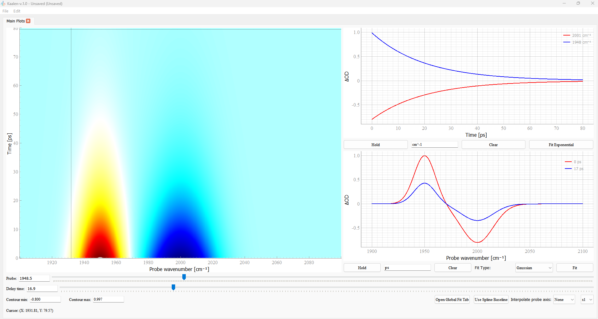

# Kaalen 

Kaalen is a intuitive desktop application for visualizing and analyzing **2D time-resolved spectroscopic data**. Built with **PyQt5, matplotlib, pyqtgraph**, and **lmfit**, this program provides a comprehensive suite of tools for tasks such as interactive data plotting, baseline correction, and **global fitting**. Kaalen (காலன்) is a Tamil mythical god who determines the lifetime of all creatures, and so too does the program determine the lifetime of the signals. The application evolved from a simple Matplotlib-based program I used extensively during my Ph.D. The need for a more robust and user-friendly tool for analyzing spectroscopic data inspired to build this comprehensive application using PyQt, making it more intuitive and accessible for everyone. 

---

## ✨ Key Features

### 🖼️ Interactive Data Visualization

* **2D map**: Display your time-resolved data as a dynamic 2D map.
* **1D Slices**: Interactively slice the 2D data along either the time (**kinetic trace**) or probe (**spectrum**) axis.
* **Live Updates**: Use sliders and input fields to precisely control the slices, with plots updating in real-time.
* **Multiple Overlays**: Hold and overlay multiple slices on a single plot for easy comparison.
* **Customizable Plots**: Adjust line thickness and axis labels to create publication-quality figures.

### 📈 Advanced Fitting & Analysis

* **Global Fitting**: Perform multi-exponential global analysis on your entire 2D dataset.
* **Automated Guesses**: Use **Singular Value Decomposition (SVD)** to automatically generate initial guesses for decay constants ($τ$).
* **Convoluted Model**: Incorporate instrument response into the fit using an analytical Gaussian-convoluted exponential model, with adjustable $t_0$ (time zero) and FWHM (Full Width at Half Maximum).
* **Fit Reporting**: View a detailed **lmfit** report with best-fit parameters, uncertainties, and R-squared value.
* **DAS Spectra**: Automatically generate and plot **Decay Associated Spectra (DAS)** from the global fit results.
* **Interactive Local Fitting**: Fit individual 1D slices with a variety of functions.
* **Exponential Decay**: Fit kinetic traces with a multi-exponential model. Draw on top of the data (click and drag).
* **Spectroscopic Peaks**: Fit spectral slices with multi-Gaussian or multi-Lorentzian functions. Draw on top of the data (click and drag)
* **Interactive Guessing**: Visually draw initial guesses for your fits directly on the plot by clicking and dragging.

---

### 📁 Project Management

* **Load & Save Projects**: Save your entire workspace, including the loaded data, current plot states, held slices, and fitting parameters, into a single project file (**`.specdatpp`**).
* **Data Export**: Export fit results, DAS spectra, and fitted 2D data to CSV files for use in other applications.

---

### Installation

Download the `.zip` file in the release and extract the files. Double click on the `.exe` file and you are good to go. Please note that the first time run takes a few seconds for the application to open.

---
### ✏️ Author's Note

This python project was developed duing my PhD work in AG Horch, FU Berlin, funded by the DFG UniSysCat grant (EXC 2008 – 390540038). It began as a custom Matplotlib-based interactive plotting tool and was later transformed into a PyQt-based application with the assistance of AI tools. It was a personal application to simplify my own data analysis, and now it is available for other users.

---

### 🤝 Contributing

Contributions are welcome! If you find a bug or have an idea for a new feature, please open an issue or submit a pull request.

---

### Citation

Please check the Zenodo link to find the DOI to cite.
